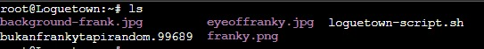

# Jaringan Komputer C-09 (2021)

Laporan Resmi Jaringan Komputer Modul 2 - DNS and Web Server

| NRP            | Nama                     |
| -------------- | ------------------------ |
| 05111940000014 | Ega Prabu Pamungkas      |
| 05111940000178 | Muhammad Rizqullah Akbar |
| 05111940000227 | Rayhan Daffa Alhafish    |

# Nomor 1

### Soal

_EniesLobby akan dijadikan sebagai DNS Master, Water7 akan dijadikan DNS Slave, dan Skypie akan digunakan sebagai Web Server. Terdapat 2 Client yaitu Loguetown, dan Alabasta. Semua node terhubung pada router Foosha, sehingga dapat mengakses internet (1)._

### Jawaban

# Nomor 2

### Soal

_Luffy ingin menghubungi Franky yang berada di EniesLobby dengan denden mushi. Kalian diminta Luffy untuk membuat website utama dengan mengakses **franky.yyy.com** dengan alias **www.franky.yyy.com** pada folder kaizoku (2)._

### Jawaban

# Nomor 3

### Soal

_Setelah itu buat subdomain super.franky.yyy.com dengan alias **www.super.franky.yyy.com** yang diatur DNS nya di EniesLobby dan mengarah ke Skypie(3)._

### Jawaban

# Nomor 4

### Soal

_Buat juga reverse domain untuk domain utama (4)._

### Jawaban

# Nomor 5

### Soal

_Supaya tetap bisa menghubungi Franky jika server EniesLobby rusak, maka buat Water7 sebagai DNS Slave untuk domain utama (5)._

### Jawaban

# Nomor 6

### Soal

_Setelah itu terdapat subdomain **mecha.franky.yyy.com** dengan alias **www.mecha.franky.yyy.com** yang didelegasikan dari EniesLobby ke Water7 dengan IP menuju ke Skypie dalam folder sunnygo(6)._

### Jawaban

# Nomor 7

### Soal

_Untuk memperlancar komunikasi Luffy dan rekannya, dibuatkan subdomain melalui Water7 dengan nama **general.mecha.franky.yyy.com** dengan alias **www.general.mecha.franky.yyy.com** yang mengarah ke Skypie(7)._

### Jawaban

Pada file `/etc/bind/delegasi/mecha.franky.com` ditambahkan konfigurasi subdomain sebagai berikut.

```
general         IN      A       192.188.2.4 ; IP Skypie
www.general     IN      A       192.188.2.4 ; IP Skypie
```


# Nomor 8

### Soal

_(8) Setelah melakukan konfigurasi server, maka dilakukan konfigurasi Webserver. Pertama dengan webserver **www.franky.yyy.com**. Pertama, luffy membutuhkan webserver dengan DocumentRoot pada /var/www/franky.yyy.com._

### Jawaban

Pada Script di Web Server Skypie dibuatkan directory baru dengan perintah `mkdir /var/www/franky.C09.com`. Lalu pada konfigurasi Apache di file `/etc/apache2/sites-available/franky.C09.com.conf` ditambahkan konfigurasi `DocumentRoot /var/www/franky.C09.com`.


# Nomor 9

### Soal

_(9) Setelah itu, Luffy juga membutuhkan agar url www.franky.yyy.com/index.php/home dapat menjadi menjadi www.franky.yyy.com/home._

### Jawaban

Dilakukan konfigurasi pada file /.htaccess untuk melakukan _rewrite_ menggunakan **REGEX** dengan konfigurasi berikut.

```
 RewriteEngine On
 RewriteCond %{REQUEST_FILENAME} !-d
 RewriteRule ^([^\.]+)$ index.php/$1 [NC,L]
```

Dengan `RewriteCond %{REQUEST_FILENAME} !-d` berarti melakukan _rewrite_ ketika kondisi request file dan tidak boleh sebuah direktori. selanjutnya `RewriteRule ^([^\.]+)$ index.php/$1 [NC,L]` merupakan aturan **REGEX**-nya, dimana `NC` berarti _Non Case Sensitive_ dan `L` berarti ketika kondisi `index.php/$1` maka `rewrite rule tidak berjalan`.


# Nomor 10

### Soal

_Setelah itu, pada subdomain **www.super.franky.yyy.com**, Luffy membutuhkan penyimpanan aset yang memiliki DocumentRoot pada /var/www/super.franky.yyy.com._

### Jawaban

ada Script di Web Server Skypie dibuatkan directory baru dengan perintah `mkdir /var/www/super.franky.C09`. Lalu pada konfigurasi Apache di file `/etc/apache2/sites-available/super.franky.C09.com.conf` ditambahkan konfigurasi `DocumentRoot /var/www/super.franky.C09`.


# Nomor 11

### Soal

_(11) Akan tetapi, pada folder /public, Luffy ingin hanya dapat melakukan directory listing saja._

### Jawaban

Untuk melakukan _directory listing_ maka pada file `/etc/apache2/sites-available/super.franky.C09.com.conf` ditambahkan konfigurasi sebagai berikut.

```
  <Directory /var/www/super.franky.C09/public/css>
                Options +Indexes
                IndexOptions Showforbidden
                <FilesMatch "\.css$">
                        Deny from all
                </FilesMatch>
        </Directory>

        <Directory /var/www/super.franky.C09/public/images>
                Options +Indexes +FollowSymLinks -Multiviews
                AllowOverride All
                IndexOptions Showforbidden
        </Directory>

        <Directory /var/www/super.franky.C09/public/js>
                Options +Indexes
                IndexOptions Showforbidden
                <FilesMatch "\.js$">
                        Deny from all
                </FilesMatch>
        </Directory>

```

Dimana di konfigurasi juga ditambahkan pembatasan akses agar file tidak bisa dibuka, sehingga hanya _directory listing_ saja.


# Nomor 12

### Soal

_(12) Tidak hanya itu, Luffy juga menyiapkan error file 404.html pada folder /error untuk mengganti error kode pada apache._

### Jawaban

Untuk menyiapkan itu maka dimasukan file 404.html terlebih dulu di direktori `/error`, Selanjutnya ditambahkan konfigurasi pada file `/etc/apache2/sites-available/super.franky.C09.com.conf` dengan `ErrorDocument 404 /error/404.html` dengan ini ketika kita mengakses file atau alamat yang tidak tersedia akan menampilkan file 404.html sebagai pesan error.


# Nomor 13

### Soal

_(13) Luffy juga meminta Nami untuk dibuatkan konfigurasi virtual host. Virtual host ini bertujuan untuk dapat mengakses file asset **www.super.franky.yyy.com/public/js** menjadi **www.super.franky.yyy.com/js**._

### Jawaban

Hal ini dapat dilakukan dengan menambahkan `Alias` pada konfigurasi website _super.franky.C09.com_ dimana pada opsi 1 merupakan alias yang ingin digunakan dan parameter kedua untuk referensi foldernya

```
        Alias "/js" "/var/www/super.franky.C09/public/js"
```


# Nomor 14

### Soal

_(14) Dan Luffy meminta untuk web www.general.mecha.franky.yyy.com hanya bisa diakses dengan port 15000 dan port 15500._

### Jawaban

Hal ini dapat dilakukan dengan hanya menambahkan port yang diinginkan 15000 dan 15500 pada konfigurasi website _general.mecha.franky.C09.com_

```
        <VirtualHost *:15000 *:15500>
```


Di atas menunjukkan jika kita mengakses _general.mecha.franky.C09.com_ tanpa menggunakan port 15000 atau 15500 maka akan muncul default page apache


Di atas menunjukkan jika kita mengakes _general.mecha.franky.C09.com_ dengan menggunakan port 15000 atau 15500 maka akan menunjukkan websitenya namun perlu autentikasi user

# Nomor 15

### Soal

_(15) dengan autentikasi username luffy dan password onepiece dan file di /var/www/general.mecha.franky.yyy._

### Jawaban

Hal ini dapat dilakukan dengan menggunakan `htpasswd -b -c passwdfile username password` dimana opsi `-b` untuk dapat menambhkan password pada command lalu `-c` untuk memasukkan username pada file penyimpanan user password. Dalam pengerjaan ini file password `passwords` disimpan di dalam folder `/usr/local/apache/passwd`

```
        htpasswd -b /usr/local/apache/passwd/passwords luffy onepiece
```


Perlu memasukkan username, yaitu `luffy`


Perlu memasukkan password, yaitu `onepiece`


Hasil dari website _general.mecha.franky.C09.com_ setelah melakukan autentikasi

# Nomor 16

### Soal

_(16) Dan setiap kali mengakses IP Skypie akan dialihkan secara otomatis ke **www.franky.yyy.com**._

### Jawaban

Hal tersebut dapat dilakukan dengan menambahkan `ServerAlias` pada konfigurasi webserver _franky.C09.com_

```
        DocumentRoot /var/www/franky.C09.com
        ServerName franky.C09.com
        ServerAlias www.franky.C09.com 192.188.2.4
```

Lalu mengakses website menggunakan IP `192.188.2.4` maka akan mengarah ke `franky.C09.com`


# Nomor 17

### Soal

_(17). Dikarenakan Franky juga ingin mengajak temannya untuk dapat menghubunginya melalui website **www.super.franky.yyy.com**, dan dikarenakan pengunjung web server pasti akan bingung dengan randomnya images yang ada, maka Franky juga meminta untuk mengganti request gambar yang memiliki substring “franky” akan diarahkan menuju franky.png. Maka bantulah Luffy untuk membuat konfigurasi dns dan web server ini!_

### Jawaban

Gunakan `RedirectMatch` untuk melakukan _redirect_ url yang dimasukkan dengan url yang diberikan, selain itu dengan meggunakan _Regex_ dalam menentukan url yang akan di-redirect. Karena file _franky.png_ terdapat pada folder _/public/images_ maka ditambahkan file _.htaccess_ pada folder tersebut dan menambahkan konfigurasi berikut

```
        RedirectMatch "(franky+)" "http://super.franky.C09.com/public/images/franky.png"
```

`+` menunjukkan bahwa harus ada substring _franky_ untuk melakukan redirect ke _super.franky.C09.com/public/images/franky.png_




# Kendala

Terdapat kesulitan dalam memahami soal 17, sempat mengira bahwa _general.franky.C09.com_ yang melakukan redirect karena berkaitan dengan sebelumnya, namun di _super.franky.C09.com_. Kesulitan memahami regex yang digunakan karena sulit dipahami :).
